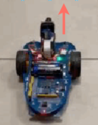
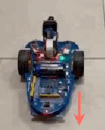
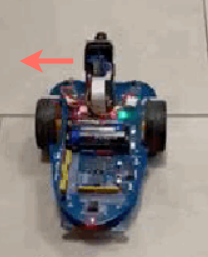
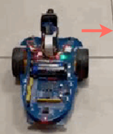
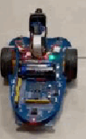

## ALPHABOT 1.0
In questo progetto il client invia un comando al server che lo esegue fino a quando non gliene viene dato un altro.

I **comandi** che possono essere dati sono:
| Nome comandi  | Descrizione                         | Direzione comandi
| :------------ | :-------- |:----------
| ` w`          | Procede avanti  |
|` s`           | Procede indietro   | 
|` a`           | Gira su se stesso verso sinistra  | 
|` d`           | Gira su se stesso verso destra|
|` q`           | Si ferma  |
