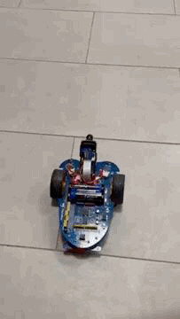

## ALPHABOT 2.0
In questo progetto il server esegue un comando che gli viene dato da un client TCP.
Il client può inviare due tipi di comandi:
  * *comandi diretti*
  * *sequenze memorizzate precedentemente*

#### Comandi diretti
I comandi diretti hanno la seguente **sintassi**:
                `comando : tempo di esecuzione in millisecondi`  
                
I **comandi** che possono essere dati sono:
| Nome comandi  | Descrizione
| :------------ | :-------- 
|` w`           | Va avanti  
|` s`           | Va indietro    
|` a`           | Gira su se stesso verso sinistra  
|` d`           | Gira su se stesso verso destra
|` q`           | Si ferma  

Nel caso si volesse è anche possibile dare una sequenza di comandi separandoli dal carattere `,`.

#### Sequenze di comandi
All'interno dell'Alphabot è presente un database che contiene alcune sequenze di comandi.
Per dire al server di eseguire una di queste sequenze è sufficiente inviare il nome.
Le sequenze memorizzate che possono essere date sono:
| Nome sequenza  | Descrizione                      |Dimostrazione del comando
| :------------  | :--------                        |:-----------------------
|` cerchio`            | Fa un cerchio                        |
|` quadrato`            | Fa un quadrato                      |
|` zigzag`            | Fa un movimento a zigzag | 
|` curva90_sinistra`            | Gira su se stesso verso sinistra di 90°   |
|` curva90_destra`            | Gira su se stesso verso destra di 90°                        |
