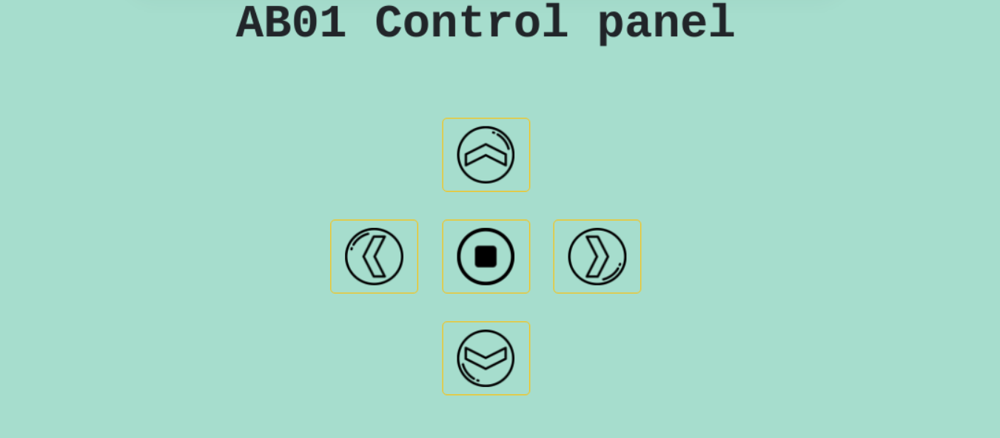

## Alphabot 3.1

In questa versione del programma Alphabot, abbiamo apportato dell modifiche grafiche al sito già presente nella versione Alphabot 3.0.

---

### Funzionamento

In questo progetto il client invia un comando al server che lo esegue fino a quando non gliene viene dato un altro, eccetto per il comando *destra* e *sinistra* dove viene effettuata una rotazione di 45°.

I **comandi** che possono essere dati sono:
| Nome comandi  | Descrizione
| :------------ | :-------- 
| ` w`          | Procede avanti  
|` s`           | Procede indietro 
|` a`           | Gira su se stesso verso sinistra
|` d`           | Gira su se stesso verso destra
|` q`           | Si ferma  

---

### Sito web
Il sito web per controllare l'Alphabot si presenta come segue.

