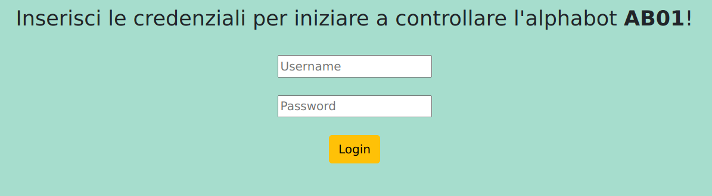
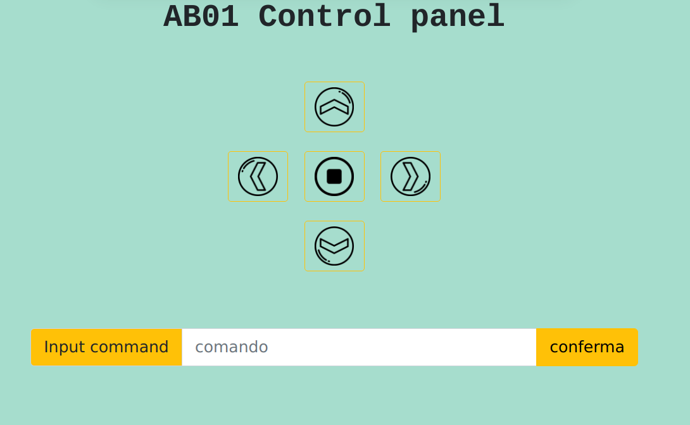

## Alphabot 5.0

In questa versione del programma c'è una comunicazione client-server attraverso il protocollo **HTTP** e viene memorizzato all'interno di un *database* 
la data e l'ora dell'accesso di ciascun utente e i comandi che vengono inseriti.

### Funzionamento
In questo progetto il client invia un comando al server che lo esegue fino a quando non gliene viene dato un altro, eccetto per il comando *destra* e *sinistra* dove viene effettuata una rotazione di 45°.

#### Comandi classici
I **comandi** che possono essere dati sono:
| Nome comandi  | Descrizione
| :------------ | :-------- 
| ` w`          | Procede avanti  
|` s`           | Procede indietro 
|` a`           | Gira su se stesso verso sinistra
|` d`           | Gira su se stesso verso destra
|` q`           | Si ferma  

#### Sequenze di comandi
All'interno dell'Alphabot è presente un database che contiene alcune sequenze di comandi.
Per dire al server di eseguire una di queste sequenze è sufficiente inserire il nome all'interno dell'*input text*.
Le sequenze memorizzate che possono essere date sono:
| Nome sequenza  | Descrizione                      
| :------------  | :--------                        
|` cerchio`            | Fa un cerchio              
|` quadrato`            | Fa un quadrato            
|` zigzag`            | Fa un movimento a zigzag 
|` curva90_sinistra`            | Gira su se stesso verso sinistra di 90°
|` curva90_destra`            | Gira su se stesso verso destra di 90°    

---

### Sito web
il sito web è composto da due pagine differenti: la pagina di login e la pagina di controllo dell'Alphabot.

#### pagina di login

#### pagina di controllo dell'Alphabot

